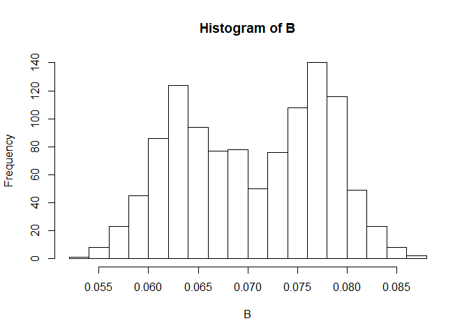

<!-- README.md is generated from README.Rmd. Please edit that file -->
txBenefit
=========

<!-- badges: start -->
<!-- badges: end -->
This tutotial provides background information and stepwise tutorial for Cb calculations.

What is Cb?
-----------

Consider a risk model that predicts the rate or risk of an outcome (e.g., 5-year mortality due to breast cancer). The risk model estimates the risk / rate of the event given an individual's characteristics. The discriminatory performance of such a model is often communicated in terms of C-statistic (or area under the curve of the receiver operating characteristic curve).

Often times, we are interested in using patient characteristics to decide whether a patient should receive treatment or not. Instead of a risk mode, in this circumstance we can develop a model directly predicting treatment benefit:

*b* = *E*(*Y*|*X*, *A* = 1)−*E*(*Y*|*X*, *A* = 0)

Cb is a threshold-free index that describes to what extent covariates X can discriminate among individuals who will differently benefit from treatment, given their covariates.

In a nutshell, Cb is conceptually equal to C-statistic for risk models.

If B1, B2, and B3 are random draws from the distibution of b (as defined in the above equation), then

*C*<sub>*b*</sub> = 1 − *E*(*B*<sub>1</sub>)/*E*(*m**a**x*(*B*<sub>2</sub>, *B*<sub>3</sub>))

The table below compares and contrasts C and Cb statstics.

<table style="width:100%;">
<colgroup>
<col width="15%" />
<col width="46%" />
<col width="38%" />
</colgroup>
<thead>
<tr class="header">
<th align="left">First Header</th>
<th align="center">C-statistic</th>
<th align="right">Cb</th>
</tr>
</thead>
<tbody>
<tr class="odd">
<td align="left">Application</td>
<td align="center">Models for risk</td>
<td align="right">Models for treatment benefit</td>
</tr>
<tr class="even">
<td align="left">Probabilistic interpretation</td>
<td align="center">Randomly select a pair of individuals, one that experiences the outconme and one that does not. C is the probability that the risk model predicts a higher risk for the individual with event</td>
<td align="right">Randomly select a pair of individuals. Consider the two scenarios: A) give treatment to one at random, B) give treatment to the one with the higher predicted benefit. Cb is the relative loss of efficiency of scenario A compared with scenario B</td>
</tr>
<tr class="odd">
<td align="left">Range</td>
<td align="center">[0.5,1]</td>
<td align="right">[0,1]</td>
</tr>
<tr class="even">
<td align="left">Interpretation</td>
<td align="center">The model with higher C is better</td>
<td align="right">The model with higher Cb is better</td>
</tr>
</tbody>
</table>

Installation
------------

You can install the development version from [GitHub](https://github.com/) with:

``` r
# install.packages("devtools")
devtools::install_github("msadatsafavi/txBenefit")
```

How the package works
---------------------

The package provides simple functions for calculating Cb for different regression models.

### Direct calculation of Cb when the vector of benefits are available.

Cb.simple() is for such an estimation method.

In the example below, we simply create vector B of randomly generated numbers.

``` r
library(txBenefit)
B<-runif(100)
res<-Cb.simple(B)
print(res)
#> [1] "Cb=0.230758901433629 - e_b=0.50987125416752 - e_max_b1b2=0.662823729930399"
```

In effect, this function equals to creating all possible pairs within the vector B, and estimating the maximum within each pair.

Now let's focus on a more realistic example. The package comes with a simulated randomized clinical trial (RCT) data, named rct\_data.

``` r
data("rct_data")
```

Let's take a look at the first few rows:

|   tx|  female|       age|  prev\_hosp|  prev\_ster|      fev1|       sgrq|       time|        tte|  n\_exac|
|----:|-------:|---------:|-----------:|-----------:|---------:|----------:|----------:|----------:|--------:|
|    1|       0|  60.04992|           0|           1|  1.125416|  0.6208415|  0.7562069|         NA|        0|
|    1|       1|  74.32678|           1|           1|  1.230864|  0.5971572|  0.9685049|         NA|        0|
|    1|       1|  69.02729|           0|           1|  1.892702|  0.2350660|  0.9969646|  0.0738847|        1|
|    1|       0|  62.51775|           0|           1|  1.070905|  0.4851237|  0.9341948|         NA|        0|
|    1|       0|  72.98540|           1|           1|  1.559421|  0.0838917|  1.0000000|         NA|        0|
|    0|       0|  70.31170|           1|           0|  1.140794|  0.5489664|  0.8978731|  0.1335712|        2|
|    1|       0|  63.56974|           0|           1|  1.384113|  0.6934356|  1.0000000|  0.9150555|        1|

This is a hypothetical RCT of two treatments for Chronic Obstructive Pulmonary Disease (COPD). COPD is a chronic disease that comes with episodes of intensified activity, called exacerbations. The benefit of treatment is in reducing the rate of such exacerbations.

The columns are as follows:

tx: treatment assignement variable (0: placebo, 1: treatment)

female: 1 for female and 0 for male

age: age in years at time of randomization

prev\_hosp: history of COPD-related hospitalization in the previous 12 months (a predictor of future exacerbation), 0: no history, 1: positive history

prev\_ster: history of COPD-related hospitalization in the previous 12 months (a predictor of future exacerbation), 0: no history, 1: positive history

fev1: Forced expiratory volume at one second, a measure of lung capacity

sgrq: St. George Respiratory Questionnaire score: a measure of functional capacity in COPD

time: total follow-up time in years (maximum 1 year)

tte: time to first exacerbation in years (NA if no exacerbation)

n\_exac: total number of exacerbations during follow-up

### Cb calculations for different regresion frameworks

The package comes with functions that help you calculate Cb for different type of regression models. These function accept a fitted regresion object and a few extra parameters and calculate Cb.

#### Logistic regression

Imagine we want to evaluate the predictability of treatment benefit in terms of reducing 6-month exacerbation risk. because in the RCT, everyone is followed for at least 6 month, there is no censoring for this outcome, and logistic regresison is a valid framework for inference.

We first create a binary variable indicating whether an exacerbation occured within the first 6 months.

``` r
rct_data[,'b_exac']<-rct_data[,'tte']<0.5
rct_data[which(is.na(rct_data[,'b_exac'])),'b_exac']<-FALSE
```

Now lets fit the regression

``` r
reg.logostic<-glm(formula = b_exac ~ tx + sgrq + prev_hosp + prev_ster + fev1, data = rct_data, family = binomial(link="logit"))

summary(reg.logostic)
#> 
#> Call:
#> glm(formula = b_exac ~ tx + sgrq + prev_hosp + prev_ster + fev1, 
#>     family = binomial(link = "logit"), data = rct_data)
#> 
#> Deviance Residuals: 
#>     Min       1Q   Median       3Q      Max  
#> -0.9824  -0.7834  -0.7181   1.3936   1.9472  
#> 
#> Coefficients:
#>             Estimate Std. Error z value Pr(>|z|)    
#> (Intercept) -1.45847    0.33185  -4.395 1.11e-05 ***
#> tx          -0.37696    0.13978  -2.697   0.0070 ** 
#> sgrq         0.47688    0.43341   1.100   0.2712    
#> prev_hosp    0.35028    0.14586   2.402   0.0163 *  
#> prev_ster   -0.05079    0.20457  -0.248   0.8039    
#> fev1         0.15754    0.13908   1.133   0.2573    
#> ---
#> Signif. codes:  0 '***' 0.001 '**' 0.01 '*' 0.05 '.' 0.1 ' ' 1
#> 
#> (Dispersion parameter for binomial family taken to be 1)
#> 
#>     Null deviance: 1254.8  on 1107  degrees of freedom
#> Residual deviance: 1238.2  on 1102  degrees of freedom
#> AIC: 1250.2
#> 
#> Number of Fisher Scoring iterations: 4
```

Now we call the Cb.logistic funciton. This function has two mandatory parameters: the glm object containing the logit model, and a text variable indicating the name of treatment variable.

``` r
res.logistic<-Cb.logistic(reg.logostic,tx_var = "tx")
print(res.logistic)
#> [1] "Cb=0.0561854696958405 - e_b=0.0704551471377305 - e_max_b1b2=0.074649356282982"
```

The main outout is Cb.

Cb.logistic (and similar functions) calculate Cb parametrically. The package includes semi-parametric methods for Cb calculation as well. To use the semi-parametric method, we simply set the value of optinal parameter semi\_parametric to TRUE.

``` r
res.logistic.NP<-Cb.logistic(reg.logostic,tx_var = "tx",semi_parametric = T)
print(res.logistic.NP)
#> [1] "Cb=0.354867544499266 - e_b=0.0713706169291377 - e_max_b1b2=0.110629400707707"
```

##### What happens under the hood?

Indeed, we can estimate the probability of outcome for each patient under each treatment allocation

``` r
new_data0<-rct_data
new_data0[,'tx']<-0
new_data1<-rct_data
new_data1[,'tx']<-1
B<-predict.glm(reg.logostic, newdata=new_data0, type="response")-predict.glm(reg.logostic, newdata =new_data1, type="response")
hist(B)
```



``` r
Cb.simple(B)
#> [1] "Cb=0.0561854696958405 - e_b=0.0704551471377305 - e_max_b1b2=0.074649356282982"
```

### Cb.poisson() for count models

First let's do this directly

``` r
reg.poisson<-glm(formula = n_exac ~ tx + tx:sgrq + prev_hosp + prev_ster + fev1 + offset(log(time)), data = rct_data, family = poisson(link="log"))

summary(reg.poisson)
#> 
#> Call:
#> glm(formula = n_exac ~ tx + tx:sgrq + prev_hosp + prev_ster + 
#>     fev1 + offset(log(time)), family = poisson(link = "log"), 
#>     data = rct_data)
#> 
#> Deviance Residuals: 
#>     Min       1Q   Median       3Q      Max  
#> -1.1813  -0.9641  -0.8135   0.6522   3.4274  
#> 
#> Coefficients:
#>              Estimate Std. Error z value Pr(>|z|)    
#> (Intercept) -0.737413   0.157466  -4.683 2.83e-06 ***
#> tx          -0.603839   0.226954  -2.661   0.0078 ** 
#> prev_hosp    0.372331   0.093027   4.002 6.27e-05 ***
#> prev_ster   -0.036207   0.130722  -0.277   0.7818    
#> fev1         0.003777   0.087115   0.043   0.9654    
#> tx:sgrq      0.513799   0.401549   1.280   0.2007    
#> ---
#> Signif. codes:  0 '***' 0.001 '**' 0.01 '*' 0.05 '.' 0.1 ' ' 1
#> 
#> (Dispersion parameter for poisson family taken to be 1)
#> 
#>     Null deviance: 1117.9  on 1107  degrees of freedom
#> Residual deviance: 1082.5  on 1102  degrees of freedom
#> AIC: 1984.6
#> 
#> Number of Fisher Scoring iterations: 5

new_data0<-rct_data
new_data0[,'tx']<-0
new_data0[,'time']<-1
new_data1<-rct_data
new_data1[,'tx']<-1
new_data1[,'time']<-1

B<-predict.glm(reg.poisson, newdata=new_data0, type="response")-predict.glm(reg.poisson, newdata =new_data1, type="response")
hist(B)
```


``` r
Cb.simple(B)
#> [1] "Cb=0.128749276222577 - e_b=0.166004421215108 - e_max_b1b2=0.19053576276571"
```

Again, like in the case of Cb.logistic(), we have a shotcut function that does all these

``` r
res.poisson<-Cb.poisson(reg.poisson,tx_var = "tx")
res.poisson
#> [1] "Cb=0.128749276222577 - e_b=0.166004421215108 - e_max_b1b2=0.19053576276571"
```

Important notes: Cb cannnot currently be calculated for Cox models that have time-dependent covariates, nor for the models with strata
